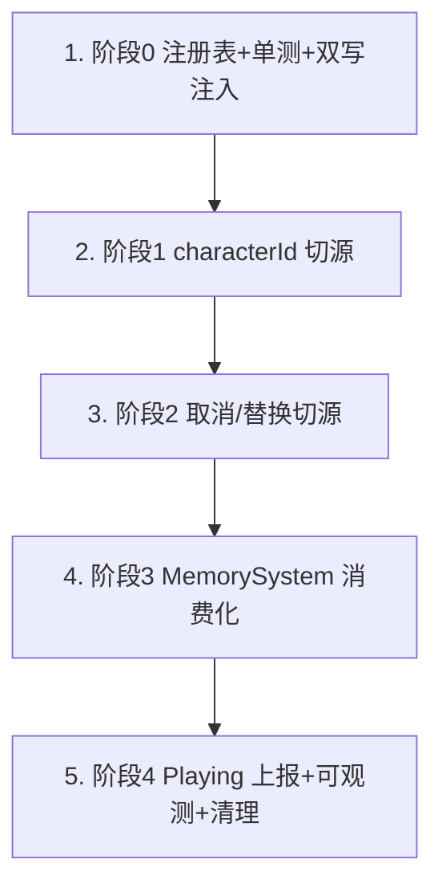

# Implementation Plan

更新时间：2026-06-07 ｜ 对应审查项：#3 ｜ 依据：design.md

## Overview

按 5 个迁移阶段推进。每个父任务对应一个阶段，结束时工程可编译（force compile 0 error）且主链路行为不变，可独立 git 回退。带 `[manual]` 的子项需用户 Play Mode 确认。阶段之间严格顺序依赖：先引入被动注册表（双写零行为变化），再逐个切换读取源，最后让 MemorySystem 消费化并清理。

## Task Dependency Graph



```json
{
  "waves": [
    { "wave": 1, "tasks": ["1.1"] },
    { "wave": 2, "tasks": ["1.2"] },
    { "wave": 3, "tasks": ["1.3", "1.4"] },
    { "wave": 4, "tasks": ["1.5"] },
    { "wave": 5, "tasks": ["2.1"] },
    { "wave": 6, "tasks": ["2.2"] },
    { "wave": 7, "tasks": ["3.1"] },
    { "wave": 8, "tasks": ["3.2"] },
    { "wave": 9, "tasks": ["4.1"] },
    { "wave": 10, "tasks": ["4.2"] },
    { "wave": 11, "tasks": ["5.1", "5.2"] },
    { "wave": 12, "tasks": ["5.3"] }
  ]
}
```

## Tasks

- [x] 1. 阶段 0：注册表核心类型与单测脚手架
- [x] 1.1 新增 `RequestStatus` 枚举与 `ConversationRequest` 记录类
  - 在 `Runtime/RequestLifecycle/RequestStatus.cs`、`ConversationRequest.cs` 定义；`IsTerminal => Status >= Finished`
  - _Requirements: 1.1_
- [x] 1.2 实现 `ConversationRequestRegistry`（Runtime/RequestLifecycle/ConversationRequestRegistry.cs）
  - `Register/TrySetStatus/TryGet/GetCharacterId/MarkOlderPendingReplaced/CancelCharacter`、`StatusChanged` 事件、`ActiveCount`/`CountByStatus`/`TrackedCount`
  - 受控转移（仅 Pending/Playing→终态，终态幂等 no-op）、批量先收集后改、有界保留（Cap 256）、非法转移 `Debug.LogWarning`
  - _Requirements: 1.1, 1.2, 1.3, 4.2_
- [x] 1.3 新增 EditMode 测试工程并覆盖不变量
  - 隔离 asmdef `VirtualPartner.RequestLifecycle` + 测试 asmdef；6 个单测覆盖 Property 1–5（全部通过）
  - _Requirements: 1.1, 1.2, 1.3, 2.1, 2.6_
- [x] 1.4 Bootstrap 创建注册表并注入（被动双写）
  - Bootstrap 新建实例并经 `BindConversationRuntime`/`ConfigureRuntime` 注入 ConversationController；ConversationController 双写（Register/MarkOlderPendingReplaced/Replaced/Failed/Finished/CancelCharacter），保留旧字典，不切换读取源。MemorySystem/StagePlanPlayer 注入延到阶段 3/4（避免未用字段告警）
  - _Requirements: 5.1, 5.2_
- [x] 1.5 编译验证并交付阶段 0
  - force compile 0 error；`[manual]` 普通对话/打断/Clear Chat 行为与改造前完全一致（注册表此时为被动观察者）
  - _Requirements: 5.1, 5.3_

- [x] 2. 阶段 1：characterId 关联切换到注册表
- [x] 2.1 用注册表替换 `requestCharacterIds`
  - `SendCurrentInput` 用 `registry.Register`；`GetCharacterIdForRequest` 改为 `registry.GetCharacterId`；移除 `requestCharacterIds` 字典
  - _Requirements: 1.1, 2.6_
- [x] 2.2 编译验证并交付阶段 1
  - force compile 0 error；`[manual]` 打断/失败/speech 的 characterId 解析与之前一致
  - _Requirements: 5.1, 5.3_

- [x] 3. 阶段 2：取消/替换状态切换到注册表
- [x] 3.1 替换/取消改用注册表状态
  - `ReplaceStaleTypingViews`→`TrySetStatus(Replaced)`；`CancelLlmForCharacter`→`registry.CancelCharacter`+`GetNonTerminalRequestIds`；`HandleLlmRequestFailed`→`TrySetStatus(Failed)`；用 `IsClearedRequest`（注册表 Canceled）替换 `clearedRequestIds` 并移除该集合；`RebuildPendingTypingViews` 改用注册表枚举
  - _Requirements: 2.1, 2.2, 2.5_
- [x] 3.2 编译验证并交付阶段 2
  - force compile 0 error
  - _Requirements: 5.1, 5.2, 5.3_

- [x] 4. 阶段 3：MemorySystem 改为注册表消费者
- [x] 4.1 MemorySystem 订阅 `StatusChanged` 并移除自维护标志
  - 订阅事件：`Finished`→按 HasSpeech 入队，`Failed/Canceled/Replaced`→丢弃负载；`MemoryTurnState` 移除 `Canceled/Replaced/Finished`，改为单一 `Dropped`（记忆域）；移除 `MarkRequestFinished/Canceled/Replaced/MarkOlderRequestsReplaced/CancelCharacterRequests`；`ClearMemory` 改用 `DropCharacterTurns`；`OnDisable` 退订
  - _Requirements: 1.4, 2.2, 2.3, 2.4, 3.2_
- [x] 4.2 编译验证并交付阶段 3
  - force compile 0 error
  - _Requirements: 5.1, 5.2, 5.3_

- [x] 5. 阶段 4：Playing 上报、可观测与清理
- [x] 5.1 Playing 上报
  - 简化：由 `HandleSpeechActionStarted`（首个 speech）`TrySetStatus(Playing)` 上报，避免给 StagePlanPlayer Configure 增参；Playing 为纯信息态
  - _Requirements: 1.4_
- [x] 5.2 调试面板只读展示
  - `ConversationController` 暴露 `ActiveRequestCount/PendingRequestCount/PlayingRequestCount`；`VirtualPartnerRuntimeDebugPanel` 增加一行展示
  - _Requirements: 4.1_
- [x] 5.3 清理遗留冗余并最终回归
  - 旧并行状态（`requestCharacterIds`/`clearedRequestIds`/记忆三标志）已全部移除，单一真源确立；编译 0 error；EditMode 单测 6/6
  - _Requirements: 1.3, 3.1, 5.1, 5.2, 5.3_

## Notes

- 注册表为注入式纯 C# 类（非静态全局），所有访问在 Unity 主线程，无需加锁。
- 阶段 0 为被动双写、零行为变化，是后续切换的安全基座。
- EditMode 单测锁定 Property 1–5；运行时行为以编译 + Play Mode 清单为准（项目无 PlayMode 自动化测试）。
- 任一阶段验证不通过即停止定位；用户已有 git 备份可整体回退。
